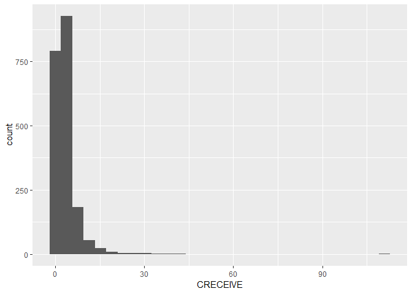

SOC 6100 Fall 2018 Assignment 01 R Notebook
================
Malcolm S. Townes
(September 16, 2018)

Introduction
------------

This is an R Notebook for Assignment 01 in SOC 6100 Fall 2018.

Project Set Up
--------------

The following code chunk enables the R Notebook to integrate seemlessly with the project organization format. This is normally included in the R Notebook to simplify file calls and enable file portability but it has been causing an error. Per Chris Prener of Saint Louis University, the error is generated because the `here::here()` function has not been tested with certain combinations of functions. To work around this problem, I've embedded the `here()` function where I enter a file path when necessary.

``` r
knitr::opts_knit$set(root.dir = here::here())
```

Load Dependencies
-----------------

The following code chunk loads package dependencies required to perform the necessary tasks. Basic tasks include importing, reading, wrangling, and cleaning data; selecting a subset of the data; checking for unique observations, and analyzing missing data.

``` r
library(tidyverse) # loads the basic R packages
```

    ## -- Attaching packages --------------------------------------------- tidyverse 1.2.1 --

    ## v ggplot2 3.0.0     v purrr   0.2.5
    ## v tibble  1.4.2     v dplyr   0.7.6
    ## v tidyr   0.8.1     v stringr 1.3.1
    ## v readr   1.1.1     v forcats 0.3.0

    ## Warning: package 'ggplot2' was built under R version 3.4.4

    ## Warning: package 'tidyr' was built under R version 3.4.4

    ## Warning: package 'purrr' was built under R version 3.4.4

    ## Warning: package 'dplyr' was built under R version 3.4.4

    ## Warning: package 'stringr' was built under R version 3.4.4

    ## Warning: package 'forcats' was built under R version 3.4.4

    ## -- Conflicts ------------------------------------------------ tidyverse_conflicts() --
    ## x dplyr::filter() masks stats::filter()
    ## x dplyr::lag()    masks stats::lag()

``` r
library(here) # enables file portability
```

    ## here() starts at D:/SOC6100/Assignments/Assignment01

``` r
library(readr) # functions for reading data
library(dplyr) # functions for data wrangling
library(janitor) # functions for data cleaning
```

    ## Warning: package 'janitor' was built under R version 3.4.4

``` r
library(naniar) # functions for analyzing missing data
library(ggplot2) # functions for data visualizations
```

Load Raw Data
-------------

The following code chunk imports the raw data from the `CSV` file.

``` r
setwd("D:/SOC6100")
DataRaw <- read.table("Data/DataNBERPatentCitations/apat63_99/apat63_99.txt", sep = ",", header = TRUE, fill = TRUE, dec = ".") # import raw data
setwd("D:/SOC6100/Assignments/Assignment01")
```

Subset Data
-----------

The following code chunk creates a subset of the data for the year 1999.

``` r
DataSubset99 <- filter(DataRaw, GYEAR>=1999) # subset data
```

    ## Warning: package 'bindrcpp' was built under R version 3.4.4

``` r
DataSubset99 <- as_tibble(DataSubset99) # convert data frame to tibble
```

The following code chunk creates a subset of the data for the period 1995 through 1999.

``` r
DataSubset95to99 <- filter(DataRaw, GYEAR>=1995) # subset data
DataSubset95to99 <- as_tibble(DataSubset95to99) # convert data frame to tibble
ObsCRECEIVE95to99 <- filter(DataSubset95to99, CRECEIVE>0)
ObsCLAIMS95to99 <- filter(DataSubset95to99, CLAIMS>0)
DataSubset95to99 %>%
  filter(CLAIMS>0) %>%
  filter(CRECEIVE>0) -> ObsDataSubset95to99
set.seed(1972)
Sample95to99 <- sample(1:nrow(ObsDataSubset95to99), 2000, replace = TRUE, prob = NULL)
ObsDataSubset95to99Sample <- ObsDataSubset95to99[Sample95to99, ]
ggplot() +
  geom_histogram(ObsDataSubset95to99Sample, mapping = aes(CRECEIVE))
```

    ## `stat_bin()` using `bins = 30`. Pick better value with `binwidth`.



Inspect Data
------------

The following code chunk evaluates the various subsetted data. For each subset, it first checks for missing data for each variable. It then checks for missing data for each variable in each observation. Then it checks for duplicate observations with the `PATENT` variable to determine if that variable can be used as a unique identifier for each observation. Finally, it checks for duplicate observations across all variables to ensure that each observation is unique.

``` r
miss_var_summary(DataSubset99, order = TRUE)
```

    ## # A tibble: 23 x 3
    ##    variable n_miss pct_miss
    ##    <chr>     <int>    <dbl>
    ##  1 CLAIMS   153486   100   
    ##  2 SECDUPBD 148958    97.0 
    ##  3 SECDLWBD 148958    97.0 
    ##  4 GENERAL  148403    96.7 
    ##  5 FWDAPLAG 148402    96.7 
    ##  6 SELFCTUB  27063    17.6 
    ##  7 SELFCTLB  27063    17.6 
    ##  8 ASSIGNEE  22782    14.8 
    ##  9 ORIGINAL   5137     3.35
    ## 10 RATIOCIT   4616     3.01
    ## # ... with 13 more rows

``` r
miss_case_summary(DataSubset99, order = TRUE)
```

    ## # A tibble: 153,486 x 3
    ##     case n_miss pct_miss
    ##    <int>  <int>    <dbl>
    ##  1   858     11     47.8
    ##  2   951     11     47.8
    ##  3  1402     11     47.8
    ##  4  1482     11     47.8
    ##  5  2308     11     47.8
    ##  6  2659     11     47.8
    ##  7  3262     11     47.8
    ##  8  3291     11     47.8
    ##  9  3306     11     47.8
    ## 10  3424     11     47.8
    ## # ... with 153,476 more rows

``` r
get_dupes(DataSubset99, PATENT)
```

    ## No duplicate combinations found of: PATENT

    ## # A tibble: 0 x 24
    ## # ... with 24 variables: PATENT <int>, dupe_count <int>, GYEAR <int>,
    ## #   GDATE <int>, APPYEAR <int>, COUNTRY <fct>, POSTATE <fct>,
    ## #   ASSIGNEE <int>, ASSCODE <int>, CLAIMS <int>, NCLASS <int>, CAT <int>,
    ## #   SUBCAT <int>, CMADE <int>, CRECEIVE <int>, RATIOCIT <dbl>,
    ## #   GENERAL <dbl>, ORIGINAL <dbl>, FWDAPLAG <dbl>, BCKGTLAG <dbl>,
    ## #   SELFCTUB <dbl>, SELFCTLB <dbl>, SECDUPBD <dbl>, SECDLWBD <dbl>

``` r
get_dupes(DataSubset99)
```

    ## No variable names specified - using all columns.

    ## No duplicate combinations found of: PATENT, GYEAR, GDATE, APPYEAR, COUNTRY, POSTATE, ASSIGNEE, ASSCODE, CLAIMS, ... and 14 other variables

    ## # A tibble: 0 x 24
    ## # ... with 24 variables: PATENT <int>, GYEAR <int>, GDATE <int>,
    ## #   APPYEAR <int>, COUNTRY <fct>, POSTATE <fct>, ASSIGNEE <int>,
    ## #   ASSCODE <int>, CLAIMS <int>, NCLASS <int>, CAT <int>, SUBCAT <int>,
    ## #   CMADE <int>, CRECEIVE <int>, RATIOCIT <dbl>, GENERAL <dbl>,
    ## #   ORIGINAL <dbl>, FWDAPLAG <dbl>, BCKGTLAG <dbl>, SELFCTUB <dbl>,
    ## #   SELFCTLB <dbl>, SECDUPBD <dbl>, SECDLWBD <dbl>, dupe_count <int>

``` r
miss_var_summary(ObsDataSubset95to99, order = TRUE)
```

    ## # A tibble: 23 x 3
    ##    variable n_miss pct_miss
    ##    <chr>     <int>    <dbl>
    ##  1 SELFCTUB  41871  16.5   
    ##  2 SELFCTLB  41871  16.5   
    ##  3 ASSIGNEE  37818  14.9   
    ##  4 SECDUPBD  37818  14.9   
    ##  5 SECDLWBD  37818  14.9   
    ##  6 ORIGINAL   5080   2.01  
    ##  7 RATIOCIT   4339   1.71  
    ##  8 BCKGTLAG   4339   1.71  
    ##  9 GENERAL      68   0.0268
    ## 10 FWDAPLAG     68   0.0268
    ## # ... with 13 more rows

``` r
miss_case_summary(ObsDataSubset95to99, order = TRUE)
```

    ## # A tibble: 253,328 x 3
    ##     case n_miss pct_miss
    ##    <int>  <int>    <dbl>
    ##  1 77710     10     43.5
    ##  2   735      8     34.8
    ##  3   864      8     34.8
    ##  4  5358      8     34.8
    ##  5  5610      8     34.8
    ##  6  7848      8     34.8
    ##  7  7908      8     34.8
    ##  8  8797      8     34.8
    ##  9  9318      8     34.8
    ## 10 12620      8     34.8
    ## # ... with 253,318 more rows

``` r
get_dupes(ObsDataSubset95to99, PATENT)
```

    ## No duplicate combinations found of: PATENT

    ## # A tibble: 0 x 24
    ## # ... with 24 variables: PATENT <int>, dupe_count <int>, GYEAR <int>,
    ## #   GDATE <int>, APPYEAR <int>, COUNTRY <fct>, POSTATE <fct>,
    ## #   ASSIGNEE <int>, ASSCODE <int>, CLAIMS <int>, NCLASS <int>, CAT <int>,
    ## #   SUBCAT <int>, CMADE <int>, CRECEIVE <int>, RATIOCIT <dbl>,
    ## #   GENERAL <dbl>, ORIGINAL <dbl>, FWDAPLAG <dbl>, BCKGTLAG <dbl>,
    ## #   SELFCTUB <dbl>, SELFCTLB <dbl>, SECDUPBD <dbl>, SECDLWBD <dbl>

``` r
get_dupes(ObsDataSubset95to99)
```

    ## No variable names specified - using all columns.

    ## No duplicate combinations found of: PATENT, GYEAR, GDATE, APPYEAR, COUNTRY, POSTATE, ASSIGNEE, ASSCODE, CLAIMS, ... and 14 other variables

    ## # A tibble: 0 x 24
    ## # ... with 24 variables: PATENT <int>, GYEAR <int>, GDATE <int>,
    ## #   APPYEAR <int>, COUNTRY <fct>, POSTATE <fct>, ASSIGNEE <int>,
    ## #   ASSCODE <int>, CLAIMS <int>, NCLASS <int>, CAT <int>, SUBCAT <int>,
    ## #   CMADE <int>, CRECEIVE <int>, RATIOCIT <dbl>, GENERAL <dbl>,
    ## #   ORIGINAL <dbl>, FWDAPLAG <dbl>, BCKGTLAG <dbl>, SELFCTUB <dbl>,
    ## #   SELFCTLB <dbl>, SECDUPBD <dbl>, SECDLWBD <dbl>, dupe_count <int>

Clean Data
----------

I did not perform any additional cleaning of the subsetted data.

``` r
View(DataSubset99, "Cleaned Data 1999")
View(ObsDataSubset95to99, "Cleaned Data 1995 to 1999")
```

Save Data
---------

The following code chunk saves the cleaned data.

``` r
write.csv(DataSubset99, here("Data/DataClean/NBERPatCit1999.csv"), append = FALSE)
```

    ## Warning in write.csv(DataSubset99, here("Data/DataClean/
    ## NBERPatCit1999.csv"), : attempt to set 'append' ignored

``` r
write.csv(ObsDataSubset95to99, here("Data/DataClean/NBERPatCit95to99.csv"), append = FALSE)
```

    ## Warning in write.csv(ObsDataSubset95to99, here("Data/DataClean/
    ## NBERPatCit95to99.csv"), : attempt to set 'append' ignored

``` r
write.csv(ObsDataSubset95to99, here("Data/DataClean/NBERPatCit95to99Sample.csv"), append = FALSE)
```

    ## Warning in write.csv(ObsDataSubset95to99, here("Data/DataClean/
    ## NBERPatCit95to99Sample.csv"), : attempt to set 'append' ignored
